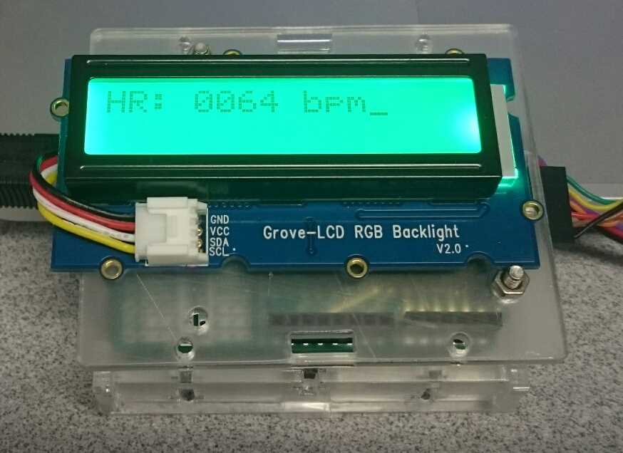

# How to build a heart rate monitor using Zephyr\* on Arduino\* 101 boards

- [Introduction](#introduction)
- [Hardware Preparation](#hardware-preparation)
- [Hardware Setup](#hardware-setup)
- [Software Setup](#software-setup)
    - [Environmental Setup](#environmental-setup)
    - [Building and Flashing the BLE Firmware](#building-and-flashing-the-ble-firmware)
    - [Getting application source code](#getting-application-source-code)
    - [Building and flashing the apps](#building-and-flashing-the-apps)
    - [Connecting from a smartphone](#connecting-from-a-smartphone)
- [Understanding the application code](#understanding-the-application-code)
    - [Data flow](#data-flow)
    - [Getting analog signal](#getting-analog-signal)
    - [Using Grove RGB LCD to show the heartbeat](#using-grove-rgb-lcd-to-show-the-heartbeat)
    - [Exchange data between ARC and x86 cores using Interprocess Mailboxes](#exchange-data-between-arc-and-x86-cores-using-interprocess-mailboxes)
    - [Sending data to connected phone over BLE](#sending-data-to-connected-phone-over-ble)
- [Summary](#summary)
- [Notices and disclaimers](#notices-and-disclaimers)

<br>

## Introduction
This is the sample app to measure heart rate using a pulse sensor
on an Arduino 101. The measured data will then be sent to a connected
smart phone over BLE.

A bluetooth firmware is neccessary to use the nRF51 Bluetooth LE controller.
Follow the instructions here to prepare the firmware:
[https://www.zephyrproject.org/doc/board/arduino_101_ble.html#arduino-101-ble](https://www.zephyrproject.org/doc/board/arduino_101_ble.html#arduino-101-ble)

Build and flash the ARC-side application with the following commands:

```
    $ make pristine && make BOARD=arduino_101_sss_factory ARCH=arc
    $ sudo -E dfu-util -a sensor_core -D output/zephyr.bins
```

Build and flash the x86-side application with these commands:

```
    $ make pristine && make BOARD=arduino_101_factory ARCH=x86
    $ sudo -E dfu-util -a x86_app -D output/zephyr.bin
```

The Zephyr Kernel is a small-footprint kernel designed for use on resource-constrained systems: from simple embedded environmental sensors and LED wearables to sophisticated smart watches and IoT wireless gateways. Among the many features that distinguish it from other RTOSes are:

* Rich I/O driver support.
* High configurability.
* Resource definition at compile time that makes it well-suited for quick prototyping. 
* Small footprint.
* Easy to optimize for specific use-cases.


The Arduino 101 board is an interesting Arduino product with an Intel® Curie™ module. Its Intel® Quark™ SE processor has two cores: an ARC core that controls the sensor subsystem, and an x86 core that controls the Bluetooth Low Energy (BLE) chip. Zephyr not only supports all sensor interfaces of the board, but also enables data exchange between the cores via the interprocessor mailboxes (IPM) mechanism and a BLE connection to other devices.
This article introduces Zephyr application development through a step-by-step explanation of how to build a heart rate sensor on an Arduino 101 board. We show details of how to read analog data from a pulse sensor and detect your heartbeat, how to visually display the heart rate and heartbeat on a Grove\* RGB LCD, and how to send heart rate data to a smartphone via a BLE connection using a standard heart rate profile. All source code is mainly based on the samples provided in the Zephyr repository. Readers can learn about the features that Zephyr provides for IoT applications and also can use this information to start building their own apps on Arduino 101 boards.

## Hardware Preparation
The following hardware parts are required to build the heart rate monitor:

* USB type B cable.
* [FTDI USB TTL serial cable.](http://www.ftdichip.com/Products/Cables/USBTTLSerial.htm)
* [Grove RGB LCD display](http://www.seeedstudio.com/wiki/Grove_-_LCD_RGB_Backlight) with a Grove universal 4-pin cable.
* [Pulse sensor.](http://pulsesensor.com/)
* [Arduino Proto Shield.](https://www.arduino.cc/en/Main/ArduinoProtoShield)
* Grove universal 4 pin connector 90°.
* L-type 6-pin male header connector.
* 7-pin female header connector.
* Two 10K ohm resistors.
* Jumper wires.
* A clear case for the Arduino 101 board. It has the same form factor as the Arduino Uno, so any case that fits the Arduino Uno can work.
* A breadboard for those who don't want to do soldering.

There are also some tools needed to build the hardware:

* Soldering tool and iron.
* Wire cutter.

## Hardware setup
Similar to other Arduino boards, the USB type B cable is necessary to flash applications to the Arduino 101 board. It can also be used to power the board at the same time. The FTDI USB TTL serial cable is used to grab data off the serial port for debugging. You can find details on how to connect them in the Zephyr Arduino 101 documentation.
The Grove RGB LCD display operates at 5V and communicates with the Arduino 101 board through the I2C bus using SCL and SDA lines. Since the Arduino 101 board operates at 3.3V and doesn't have an internal pull-up circuit, we need to create one.

1. Connect the 3.3V line to two 10K ohm resistors.
2. Connect the SCL and SDA lines to the pull-up circuit.
3. The SCL and SDA lines then go to the equivalent pins on the Grove RGB LCD display.
4. Connect the 5V and GND pins from the board to those of the display respectively.

The pulse sensor can operate at 3.3V or 5V. We use 3.3V for the Arduino 101. There are three cables connected to the sensor. Connect the red line to the 3.3V pin on the board, the black line to GND, and the purple line to Analog IN A2. You can specify any pin, from A0 to A5, by defining ADC_CHANNEL in the code. Use the following:

* 10 for A0
* 11 for A1
* 12 for A2
* 13 for A3
* 14 for A4
* 15 for A5

Follow the getting started video in PulseSensor.com to prepare the pulse sensor. Take note that sweat on your fingers could potentially cause short circuits that can damage the sensor. Take proper precautions to avoid causing short circuits. 
The Arduino 101 board uses digital pins 0 (RX) and 1 (TX) to send and receive serial data. Connect the following pins and lines:

1. Connect pin 0 (*RX*) on the board to the orange line, pin 5 (*TX*), of the USB FTDI cable.
2. Connect pin 1 (*TX*) of the board to the yellow line, pin 4 (*RX*) of the USB FTDI cable.
3. Finally, connect *GND* to the black line, pin 0 (*GND*) of the FTDI cable.


*Figure 1: Wiring with the breadboard*

*Figure 1* shows an example of how to wire the device using a breadboard. The two 10K ohm resistors are used to make the pull-up circuit. They are connected to the 3.3V output at one end, and to the SCL and SDA at the other end, which transfer signals to the LCD. The pulse sensor shares the 3.3V line with the pull-up circuit (red cable), and uses A2 to send analog data to the board. The brown and orange jumper wires are connected to pin 0 and pin 1 at one end, and to TX and RX of the USB FTDI card respectively.

 

*Figure 2: Front of Proto Shield*


*Figure 3: Front of Proto Shield*


*Figure 2* & *Figure 3* show an Arduino Proto Shield rev. 3 with circuits that are generally similar to the breadboard, but they are soldered down instead. The shield provides convenient 5V and GND connections for circuits. Pin 0 and pin 1 of the 7-pin female connector are bent to reach the 3.3V and GND ports, while the other five pins go into analog input ports.

 

*Figure 4: Hardware Setup*



*Figure 5: Heart Rate Monitor in a case*


*Figure 4* and *Figure 5* show the hardware setup before and after getting the hardware inside a clear case. The Proto Shield has exactly the same form factor as the Arduino 101 board, so you can use some long M3 bolts to hold them together in the clear case.

##Software setup

### Environmental setup

The Zephyr programming environment needs to be set up to compile and flash applications. Details on how to setup the Zephyr programming environment and prepare the Arduino 101 board can be found here.

### Building and flashing the BLE firmware
The Arduino 101 board comes with a Nordic Semiconductor nRF51 Bluetooth LE controller. The Arduino 101 factory-installed firmware on this controller is not supported by Zephyr, so a new one needs to be flashed onto it. Follow the instructions on the [Zephyr website](https://www.zephyrproject.org/doc/board/arduino_101_ble.html#arduino-101-ble) to build and flash the firmware to the board. 

### Getting application source code
Check out the source code for the heart rate monitor application [here](https://www.zephyrproject.org/doc/board/arduino_101.html). 

```
    $ git clone https://gerrit.zephyrproject.org/r/heartrate-monitor
```

### Building and flashing the apps
Build and flash the ARC-side application with the following commands:
 
```
$ cd heartrate-monitor
$ make pristine && make BOARD=arduino_101_sss_factory ARCH=arc
$ sudo -E dfu-util -a sensor_core -D output/zephyr.bin
```

Build and flash the x86-side application with these commands:

```
    $ make pristine && make BOARD=arduino_101_factory ARCH=x86
    $ sudo -E dfu-util -a x86_app -D output/zephyr.bin
```

### Connecting from a smartphone
A portable device that supports BLE can be used to connect to the Arduino 101 board. This example has been tested with the default Health app on the iPhone* and the nRF Toolbox app on Android* devices.

 

*Figure 6: iOS\* Health App*


*Figure 7: nRF Toolbox App*

On an iPhone, use the following instructions:

1. Open Settings > Bluetooth to scan for and pair with Zephyr Heartrate Monitor.
2. Launch the Health app.
3. Go to Health Data > Vitals > Heart Rate. 
4. Put your finger on the pulse sensor.
5. After several seconds, the heart rate data will appear on the Grove LCD and the Health app screen.

On an Android phone, use these instructions:

1. Open the nRF Toolbox.
2. Go to HRM and enable Bluetooth if asked.
3. Select Connect, and pair the phone with the Zephyr Heartrate Monitor device.
4. Put your finger on the pulse sensor.
5. After several seconds, the heart rate data will appear on the Grove LCD and the app screen.

## Understanding the application code


*Figure 8: Data Flow*

### Data Flow

*Figure 8* depicts the data flow in the example. The application running on the ARC processor takes data from the pulse sensor through the ADC interface. It analyzes the data and decides whether the data means heartbeats. When the ARC app detects a heartbeat, it displays the heart rate in the Grove LCD and flashes the LCD to show the beat. At the same time, the app sends the heart rate data over the IPM to the x86 side. Then the x86 application receives the heart rate data and controls the nRF51 BLE chip over IPC to notify a connected device of the new value using the BLE heart rate profile.

### Getting analog signal

To measure the heartbeat exactly, the ARC core needs to read analog data from the pulse sensor every 2 ms. First, ADC driver must be enabled and the SYS_CLOCK_TICKS_PER_SEC config for ARC needs to be configured to be high enough instead of the default value. This is done in the following lines in the **prj_arc.conf** config file:

```
CONFIG_ADC=y
CONFIG_SYS_CLOCK_TICKS_PER_SEC=1000
```

Second, in the main loop of the program, the processing needs to repeat every 2 ms. To do that,  enter the following in the **main_arc.c** file:

```
#define INTERVAL        2
#define SLEEPTICKS MSEC(INTERVAL)
...
void main(void)
{
    struct nano_timer timer;
    nano_timer_init(&timer, data);
    …
    while (1) {
        <process data analysis>
        …
        nano_timer_start(&timer, SLEEPTICKS);
        nano_timer_test(&timer, TICKS_UNLIMITED);
    }
}
```

The app uses a buffer of four uint8_t bytes to store the analog signal from the pulse sensor. It converts them to one uint32_t value and uses that value for analysis.

```
#define ADC_BUFFER_SIZE 4
static uint8_t seq_buffer[ADC_BUFFER_SIZE];
...
uint32_t signal = (uint32_t) seq_buffer[0]
                | (uint32_t) seq_buffer[1] << 8
                | (uint32_t) seq_buffer[2] << 16
                | (uint32_t) seq_buffer[3] << 24;

value = measure_heartrate(signal);
```

The analysis for a heartbeat is processed in **heartbeat.c**. It refers to the source code from [PulseSensor](https://github.com/WorldFamousElectronics/PulseSensor_Amped_Arduino/tree/master/PulseSensorAmped_Arduino_1dot4), but modifies the values since the Arduino 101 board uses 12-bit ADC instead of 10-bit ADC like other Arduino boards.

###Using Grove RGB LCD to show the heartbeat
This refers to the grove_lcd sample in the Zephyr source tree. The extra thing here is that the heart rate monitor example defines the color code for heart rate: blue for heart rates less than 60 beats per minute (bpm), green for 60 to 79 bpm, yellow for 80 to 99 bpm, and red for heart rates equal to or faster than 100 bpm. It also uses the *show_heartbeat_using_fade_effect()* function to fade out the brightness and thus simulate the heartbeat.

```
static void show_heartbeat_using_fade_effect(int index)
{
    uint8_t red, green, blue;
    if (!glcd || fadeRate < 0 || index < 0 || index > 3) {
        return;
}

    red = (color[index][0] * fadeRate / 255) & 0xff;
    green = (color[index][1] * fadeRate / 255) & 0xff;
    blue = (color[index][2] * fadeRate / 255) & 0xff;
    glcd_color_set(glcd, red, green, blue);

    fadeRate -= 15;
}
```

### Exchange data between ARC and x86 cores using interprocessor mailboxes (IPM)
There are three types of data passing services in Zephyr: FIFOs, PIPEs and Mailboxes. In this example we use interprocessor mailboxes, also called IPM. This is an implementation of a traditional message queue that allows tasks to exchange messages. A sender task sends the messages and a receiver task receives those messages. Here, data flows from ARC to x86, so the ARC side is the sender, and the x86 side is the receiver. You can configure this with the proper settings.
In **prj_arc.conf** for the ARC app, make sure you have:

```
CONFIG_IPM=y
CONFIG_IPM_QUARK_SE=y
CONFIG_IPM_CONSOLE_SENDER=y
```

In **prj_x86.conf** for the x86 app:

```
CONFIG_IPM=y
CONFIG_IPM_QUARK_SE=y
CONFIG_IPM_QUARK_SE_MASTER=y
CONFIG_IPM_CONSOLE_RECEIVER=y
```

And in the source code, the ARC side uses the IPM API to send messages containing heart rate data to the x86 side. In the **main_arc.c** file:

```
ipm_value = (uint8_t) value;
ret = ipm_send(ipm, 1, HRS_ID, &ipm_value, sizeof(ipm_value));
if (ret) {
    printk("Failed to send IPM message, error (%d)\n", ret);
}
```

The x86 app registers a callback to read the heart rate value and send over BLE connection whenever there is a new message. In the **main_x86.c** file, we do the following:

```
struct device *ipm;
ipm = device_get_binding("hrs_ipm");
ipm_set_enabled(ipm, 1);
ipm_register_callback(ipm, hrs_ipm_callback, NULL);
...
void hrs_ipm_callback(void *context, uint32_t id, volatile void *data)
{
    uint8_t value = *(volatile uint8_t *) data;
    switch (id) {
        /* only accept value from defined HRS channel */
        case HRS_ID:
            hrs_value = (uint16_t) value << 8 | 0x06;
            if (default_conn) {
                bt_gatt_notify(default_conn, &hrs_attrs[2], &hrs_value, sizeof(hrs_value));
            }
            break;
        default:
            break;
    }
}
```
where *bt_gatt_notify()* call is used to send data to the currently paired BLE connection. More details about Zephyr mailboxes can be found in Zephyr documentation.

### Sending data to connected phone over BLE

The app needs to be configured to use the BLE firmware. For that purpose, the following configurations are defined in the **prj_x86.conf** file:

```
CONFIG_BLUETOOTH=y
CONFIG_BLUETOOTH_LE=y
CONFIG_BLUETOOTH_SMP=y
CONFIG_BLUETOOTH_PERIPHERAL=y
CONFIG_BLUETOOTH_GATT_DYNAMIC_DB=y
```

The x86-side app notifies the connected device of the heart rate value it receives from the ARC-side using the BLE heart rate service. There are several steps here:

1. First, the x86 app needs to declare and register itself as a GAP (generic access profile) with peripheral role so that it can advertise its presence, enabling central devices to discover it for connection. The x86 app must also declare and register itself as a heart rate service (HRS) so that the connected device can understand and use the appropriate app to use the service. 
2. Second, it needs to monitor the connections so that it can notify the connected device. 
3. Finally, the x86 app sends notifications upon getting a new heart rate value from the ARC side.

For the first step, it declares the following attributes:

```
static struct bt_gatt_attr gap_attrs[] = {
    BT_GATT_PRIMARY_SERVICE(BT_UUID_GAP),
    BT_GATT_CHARACTERISTIC(BT_UUID_GAP_DEVICE_NAME, BT_GATT_CHRC_READ),
    BT_GATT_DESCRIPTOR(BT_UUID_GAP_DEVICE_NAME, BT_GATT_PERM_READ, read_name, NULL, NULL),
    BT_GATT_CHARACTERISTIC(BT_UUID_GAP_APPEARANCE, BT_GATT_CHRC_READ),
    BT_GATT_DESCRIPTOR(BT_UUID_GAP_APPEARANCE, BT_GATT_PERM_READ, read_appearance, NULL, NULL)
};

static struct bt_gatt_attr hrs_attrs[] = {
    BT_GATT_PRIMARY_SERVICE(BT_UUID_HRS),
    BT_GATT_CHARACTERISTIC(BT_UUID_HRS_MEASUREMENT, BT_GATT_CHRC_NOTIFY),
    BT_GATT_DESCRIPTOR(BT_UUID_HRS_MEASUREMENT, BT_GATT_PERM_READ, NULL, NULL, NULL),
    BT_GATT_CCC(hrmc_ccc_cfg, NULL)
};
```
And registers those attributes when Bluetooth is ready, as shown:

```
bt_gatt_register(gap_attrs, ARRAY_SIZE(gap_attrs));
bt_gatt_register(hrs_attrs, ARRAY_SIZE(hrs_attrs));
```

The app then starts to advertise itself for connection. Here ad[] is the data used in advertisement packets, where the flag setting makes it discoverable to other devices, and the UUID setting declares it as the heart rate service, as described in [bluetooth.org](https://developer.bluetooth.org/gatt/services/Pages/ServicesHome.aspx). The sd[] array is the data used in scan response packets. 

```
static const struct bt_data ad[] = {
    BT_DATA_BYTES(BT_DATA_FLAGS, (BT_LE_AD_GENERAL | BT_LE_AD_NO_BREDR)), BT_DATA_BYTES(BT_DATA_UUID16_ALL, 0x0d, 0x18)
};

static const struct bt_data sd[] = {
    BT_DATA(BT_DATA_NAME_COMPLETE, DEVICE_NAME, DEVICE_NAME_LEN)
};
...
err = bt_le_adv_start(BT_LE_ADV_CONN, ad, ARRAY_SIZE(ad),sd, ARRAY_SIZE(sd));
if (err) {
    printk("Advertising failed to start (err %d)\n", err);
    return;
}
```

The app manages the connection (default_conn) by registering callbacks on new connection or disconnection events.

```
static void connected(struct bt_conn *conn, uint8_t err)
{
    if (err) {
        printk("Connection failed (err %u)\n", err);
    } else {
            default_conn = bt_conn_ref(conn);
            printk("Connected\n");
        }
}

static void disconnected(struct bt_conn *conn, uint8_t reason)
{
    printk("Disconnected (reason %u)\n", reason);
    if (default_conn) {
       bt_conn_unref(default_conn);
       default_conn = NULL;
    }
}

static struct bt_conn_cb conn_callbacks = {
    .connected = connected,
    .disconnected = disconnected,
};
...
bt_conn_cb_register(&conn_callbacks);
```

Finally, the app notifies the connected device of the new heart rate value:

```
if (default_conn) {
    bt_gatt_notify(default_conn, &hrs_attrs[2], &hrs_value, sizeof(hrs_value));
}
```

## Summary
Now you can build your own heart rate monitor using Zephyr on an Arduino 101 board. There are many more sensor app samples and usages in the Zephyr source tree that can help you to get started both with the Arduino 101 board and the Zephyr kernel in general.

## Notices and disclaimers
No license (express or implied, by estoppel or otherwise) to any intellectual property rights is granted by this document.

Intel disclaims all express and implied warranties, including without limitation, the implied warranties of merchantability, fitness for a particular purpose, and non-infringement, as well as any warranty arising from course of performance, course of dealing, or usage in trade.

Intel and the Intel logo are trademarks of Intel Corporation in the U.S. and/or other countries. 

ARDUINO 101 and the ARDUINO infinity logo are trademarks or registered trademarks of Arduino, LLC.

*Other names and brands may be claimed as the property of others.
© 2016 Intel Corporation.

